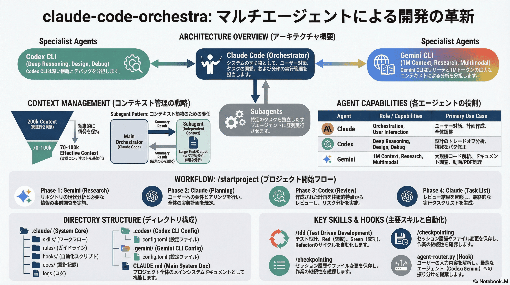

# claude-code-orchestra



Multi-Agent AI Development Environment

```
Claude Code (Orchestrator) ─┬─ Gemini CLI (Research)
                            └─ Subagents (Parallel Tasks)
```

## Quick Start

既存プロジェクトのルートで実行:

```bash
git clone --depth 1 https://github.com/DeL-TaiseiOzaki/claude-code-orchestra.git .starter && cp -r .starter/.claude .starter/.gemini .starter/CLAUDE.md . && rm -rf .starter && claude
```

## Prerequisites

### Claude Code

```bash
npm install -g @anthropic-ai/claude-code
claude login
```

### Gemini CLI

```bash
npm install -g @google/gemini-cli
gemini login
```

## Architecture

```
┌─────────────────────────────────────────────────────────────┐
│           Claude Code (Orchestrator)                        │
│           → コンテキスト節約が最優先                         │
│           → ユーザー対話・調整・実行を担当                   │
│                      ↓                                      │
│  ┌───────────────────────────────────────────────────────┐  │
│  │              Subagent (general-purpose)               │  │
│  │              → 独立したコンテキストを持つ               │  │
│  │              → Gemini を呼び出し可能                   │  │
│  │              → 結果を要約してメインに返す              │  │
│  │                                                       │  │
│  │              ┌──────────────┐                         │  │
│  │              │  Gemini CLI  │                         │  │
│  │              │  リサーチ    │                         │  │
│  │              │  マルチモーダル│                        │  │
│  │              └──────────────┘                         │  │
│  └───────────────────────────────────────────────────────┘  │
└─────────────────────────────────────────────────────────────┘
```

### コンテキスト管理（重要）

メインオーケストレーターのコンテキストを節約するため、大きな出力が予想されるタスクはサブエージェント経由で実行します。

| 状況 | 推奨方法 |
|------|----------|
| 大きな出力が予想される | サブエージェント経由 |
| 短い質問・短い回答 | 直接呼び出しOK |
| Gemini相談 | サブエージェント経由 |
| 詳細な分析が必要 | サブエージェント経由 → ファイル保存 |

## Directory Structure

```
.
├── CLAUDE.md                    # メインシステムドキュメント
├── README.md
├── pyproject.toml               # Python プロジェクト設定
├── uv.lock                      # 依存関係ロックファイル
│
├── .claude/
│   ├── agents/
│   │   └── general-purpose.md   # サブエージェント設定
│   │
│   ├── skills/                  # 再利用可能なワークフロー
│   │   ├── startproject/        # プロジェクト開始
│   │   ├── plan/                # 実装計画作成
│   │   ├── tdd/                 # テスト駆動開発
│   │   ├── checkpointing/       # セッション永続化
│   │   ├── gemini-system/       # Gemini CLI連携
│   │   └── ...
│   │
│   ├── hooks/                   # 自動化フック
│   │   ├── agent-router.py      # エージェントルーティング
│   │   ├── lint-on-save.py      # 保存時自動lint
│   │   └── ...
│   │
│   ├── rules/                   # 開発ガイドライン
│   │   ├── coding-principles.md
│   │   ├── testing.md
│   │   └── ...
│   │
│   ├── docs/
│   │   ├── DESIGN.md            # 設計決定記録
│   │   ├── research/            # Gemini調査結果
│   │   └── libraries/           # ライブラリ制約
│   │
│   └── logs/
│       └── cli-tools.jsonl      # Gemini入出力ログ
│
└── .gemini/                     # Gemini CLI設定
    ├── GEMINI.md
    └── settings.json
```

## Skills

### `/startproject` — プロジェクト開始

マルチエージェント協調でプロジェクトを開始します。

```
/startproject ユーザー認証機能
```

**ワークフロー:**
1. **Gemini** → リポジトリ分析・事前調査
2. **Claude** → 要件ヒアリング・計画作成
3. **Claude** → タスクリスト作成

### `/plan` — 実装計画

要件を具体的なステップに分解します。

```
/plan APIエンドポイントの追加
```

**出力:**
- 実装ステップ（ファイル・変更内容・検証方法）
- 依存関係・リスク
- 検証基準

### `/tdd` — テスト駆動開発

Red-Green-Refactorサイクルで実装します。

```
/tdd ユーザー登録機能
```

**ワークフロー:**
1. テストケース設計
2. 失敗するテスト作成（Red）
3. 最小限の実装（Green）
4. リファクタリング（Refactor）

### `/checkpointing` — セッション永続化

セッションの状態を保存します。

```bash
/checkpointing              # 基本: 履歴ログ
/checkpointing --full       # 完全: git履歴・ファイル変更含む
/checkpointing --analyze    # 分析: 再利用可能なスキルパターン発見
```

### `/gemini-system` — Gemini CLI連携

リサーチ・大規模分析・マルチモーダル処理に使用します。

**トリガー例:**
- 「調べて」「リサーチして」
- 「このPDF/動画を見て」
- 「コードベース全体を理解して」

### `/simplify` — コードリファクタリング

コードを簡潔化・可読性向上させます。

### `/design-tracker` — 設計決定追跡

アーキテクチャ・実装決定を自動記録します。

## Development

### Tech Stack

| ツール | 用途 |
|--------|------|
| **uv** | パッケージ管理（pip禁止） |
| **ruff** | リント・フォーマット |
| **mypy** | 型チェック |
| **pytest** | テスト |
| **poethepoet** | タスクランナー |

### Commands

```bash
# 依存関係
uv add <package>           # パッケージ追加
uv add --dev <package>     # 開発依存追加
uv sync                    # 依存関係同期

# 品質チェック
poe lint                   # ruff check + format
poe typecheck              # mypy
poe test                   # pytest
poe all                    # 全チェック実行

# 直接実行
uv run pytest -v
uv run ruff check .
```

## Hooks

自動化フックにより、適切なタイミングでエージェント連携を提案します。

| フック | トリガー | 動作 |
|--------|----------|------|
| `agent-router.py` | ユーザー入力 | Geminiへのルーティング提案 |
| `lint-on-save.py` | ファイル保存 | 自動lint実行 |
| `log-cli-tools.py` | Gemini実行 | 入出力ログ記録 |

## Language Rules

- **コード・思考・推論**: 英語
- **ユーザーへの応答**: 日本語
- **技術ドキュメント**: 英語
- **README等**: 日本語可
